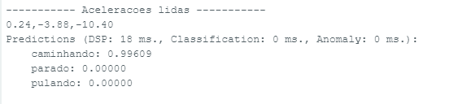
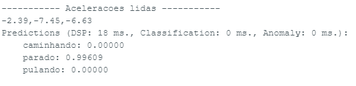
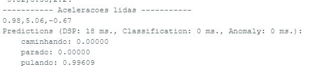

# Projeto de Classificação de Movimento com Acelerômetro e LEDs

Este projeto utiliza um acelerômetro **LIS3DH** e LEDs para classificar movimentos, como "caminhando", "parado" e "pulando", usando inferência de machine learning embarcada. O código lê os dados do acelerômetro, executa a classificação e controla três LEDs para indicar o movimento detectado.

## Requisitos

- **Placa ESP32/ESP32-S2**
- **LIS3DH** (Acelerômetro)
- **Edge Impulse SDK**
- Bibliotecas:
  - `Wire.h`
  - `SPI.h`
  - `Adafruit_LIS3DH`
  - `Adafruit_Sensor`
  - `accel_inferencing.h`

## Hardware

### Conexões:

- **LIS3DH:**
  - MOSI: Pino 35
  - MISO: Pino 37
  - CLK: Pino 36
  - CS: Pino 34

- **LEDs:**
  - LED Vermelho (caminhando): Pino 14
  - LED Azul (pulando): Pino 12
  - LED Verde (parado): Pino 13

## Funcionamento

1. O acelerômetro é inicializado e configurado para operar em modo normal e taxa de amostragem de 50 Hz.
2. Os dados do acelerômetro (nos eixos X, Y e Z) são lidos e armazenados em um buffer.
3. O classificador de machine learning processa esses dados para identificar o movimento.
4. Com base na predição do classificador:
   - O LED vermelho acende se o movimento identificado for "caminhando".
   - O LED azul acende para "pulando".
   - O LED verde acende para "parado".
   - Se nenhuma predição for suficientemente alta, todos os LEDs permanecem apagados.

## Como usar

1. Conecte o acelerômetro **LIS3DH** e os LEDs conforme descrito.
2. Faça upload do código para a placa ESP32.
3. Abra o monitor serial para ver as predições em tempo real.

## Resultados

## Dependências

- Biblioteca **Edge Impulse** para realizar a inferência de machine learning.
- Bibliotecas **Adafruit_LIS3DH** e **Adafruit_Sensor** para comunicação com o acelerômetro.

